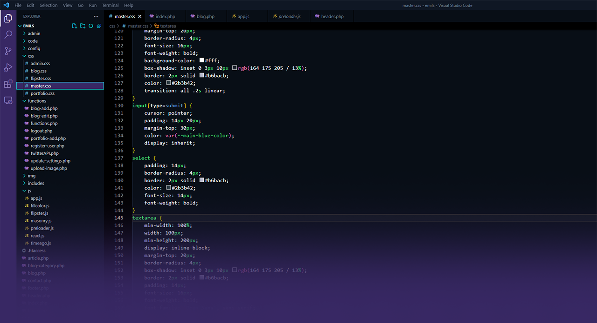
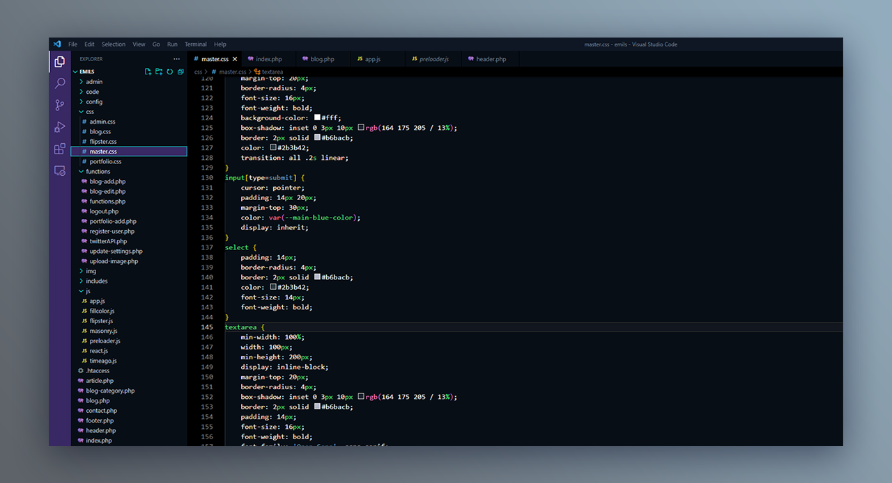

# MoxoCode Theme

A beautiful dark theme with purple and blue accents for Visual Studio Code.

## Preview



## Installation

### From VS Code Marketplace
1. Open VS Code
2. Go to Extensions (`Ctrl+Shift+X`)
3. Search for "MoxoCode Theme"
4. Click Install
5. Go to `File > Preferences > Color Theme` and select "MoxoCode"

### Manual Installation
1. Download the `.vsix` file from [releases](https://github.com/emilanderss0n/MoxoCode/releases)
2. Open VS Code
3. Run `code --install-extension moxocode-theme-1.0.0.vsix`
4. Select "MoxoCode" from Color Theme menu

## Features

- 🌙 Dark theme optimized for long coding sessions
- 💜 Purple and blue color scheme
- ⚡ High contrast for excellent readability
- 🎨 Carefully designed syntax highlighting
- 🔧 Support for JavaScript, TypeScript, Python, HTML, CSS, and more



## Color Palette

- **Background**: `#080e16` - Deep dark blue
- **Primary**: `#382864` - Rich purple
- **Accent**: `#6155b9` - Bright purple
- **Text**: `#ffffff` - Pure white

## Development

To build the theme yourself:

```bash
npm install -g vsce
vsce package
```

## License

MIT License - see [LICENSE](LICENSE) for details.
